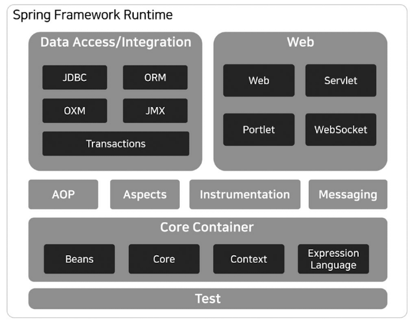

# Spring Boot A to Z

> Spring Boot makes it easy to create stand-alone, production-grade Spring based Applications that you can "just run".

Spring Boot is a framework for building web applications based on the Spring Framework, a Java framework for building enterprise applications. It is designed to make it easy to create stand-alone, production-grade Spring-based applications with minimal configuration.

<br/>

### Advantages of Spring Boot include:

- Convention over configuration, which means that developers can get started quickly with minimal setup.
- Built-in support for common web application features, such as security and data access.
- A large and active community, which means that there are many resources available for troubleshooting and getting help.
- A wide range of integration options with other frameworks and technologies.

<br/>

### Disadvantages of Spring Boot include:

- The learning curve can be steep for developers who are not familiar with the Spring Framework.
- Spring Boot applications may have a higher memory footprint compared to some other frameworks.
- Some developers may find the configuration options to be overwhelming and confusing.

<br/>

Spring Boot is a powerful and feature-rich framework that is well suited for enterprise-level web applications and microservices, it also provides a number of development tools and features that can help developers to be more productive. However, it may be overkill for smaller projects, has a steeper learning curve compared to some other frameworks and may require more resources.

<br/>



<br/>

<br/>

<br/>

## Demo. Projects

- `maven-demo`
- `spring-demo`

<br/>

<br/>

<br/>

## *background knowledge*

### Object-Oriented Programming (OOP)

Object-Oriented Programming (OOP) is a programming paradigm that is based on the concept of "objects", which can contain data and code that manipulates that data. These objects are instances of classes, which define their properties and behavior. A simple example of OOP in Java would be a class for a "Person" object, which has properties like name and age, and methods like "setName" and "getAge":

```java
public class Person {
  private String name;
  private int age;

  public Person(String name, int age) {
    this.name = name;
    this.age = age;
  }

  public void setName(String name) {
    this.name = name;
  }

  public String getName() {
    return name;
  }

  public void setAge(int age) {
    this.age = age;
  }

  public int getAge() {
    return age;
  }
}
```

<br/>

### Aspect-Oriented Programming (AOP)

Aspect-Oriented Programming (AOP) is a programming paradigm that aims to increase modularity by allowing the separation of concerns. It allows you to define "aspects" that capture concerns that cut across multiple classes, such as logging, security, and transaction management. In Spring, AOP is used to implement these cross-cutting concerns. A simple example of AOP in Spring would be a logging aspect that logs method calls:

```java
@Aspect
@Component
public class LoggingAspect {

  @Before("execution(* com.example.demo.*.*(..))")
  public void logMethodCall(JoinPoint joinPoint) {
    System.out.println("Calling method: " + joinPoint.getSignature().getName());
  }
}

```

In this example, the `@Aspect` and `@Component` annotations are used to mark the class as an aspect and make it a bean managed by Spring. The `@Before` annotation is used to specify that the `logMethodCall` method should be called before any method call matched by the pointcut expression "execution(* com.example.demo.*.*(..))"

<br/>

### DispatcherServlet

The DispatcherServlet is the front controller in the Spring MVC framework. It is responsible for handling all incoming HTTP requests and forwarding them to the appropriate controllers for handling. Here is a general overview of the operation flow of the DispatcherServlet in Spring Boot:

1. A user sends an HTTP request to a web server, which is then forwarded to the DispatcherServlet.
2. The DispatcherServlet first checks if the request matches any of the pre-configured URL mappings.
3. If a match is found, the DispatcherServlet will then forward the request to the corresponding controller.
4. The controller handles the request and generates a model, which is a set of data that needs to be passed to the view.
5. The DispatcherServlet then forwards the request and the model to the appropriate view, which can be a JSP, Thymeleaf template, or any other type of view.
6. The view uses the model data to generate an HTML response, which is then sent back to the user's browser.
7. If the request does not match any of the pre-configured URL mappings, the DispatcherServlet will return a 404 error (Not Found) or other appropriate error message.

<br/>

### DTO & DAO

DTO stands for Data Transfer Object and DAO stands for Data Access Object. They are both design patterns that are commonly used in the Spring framework, and in Spring Boot specifically.

DTO is a design pattern that is used to transfer data between different layers of an application. DTOs are typically used to transfer data between the presentation layer (such as a web interface) and the service layer (where business logic is handled). DTOs are usually simple Java objects that have fields for the data that needs to be transferred and getter and setter methods for those fields.

A simple example of a DTO class in Spring Boot would be:

```java
public class PersonDto {
  private String name;
  private int age;
  
  public PersonDto(String name, int age) {
    this.name = name;
    this.age = age;
  }
  
  public String getName() {
    return name;
  }
  
  public void setName(String name) {
    this.name = name;
  }
  
  public int getAge() {
    return age;
  }
  
  public void setAge(int age) {
    this.age = age;
  }
}
```

DAO stands for Data Access Object and is a design pattern that is used to abstract the details of how data is retrieved and stored from the rest of the application. A DAO typically provides a set of methods for CRUD (Create, Read, Update, Delete) operations on a specific type of data.

A simple example of a DAO interface in Spring Boot would be:

```java
public interface PersonDao {

  public Person save(Person person);
  public Person findById(long id);
  public List<Person> findAll();
  public void delete(long id);
}
```

In Spring Boot, you can use the built-in support for the JPA (Java Persistence API) to easily implement DAOs, which allows you to work with data in a database using Java objects.

In summary, DTOs are objects used for transferring data between layers, DAOs are objects used for data access, and when using Spring Boot, you can use JPA to easily implement DAOs.
